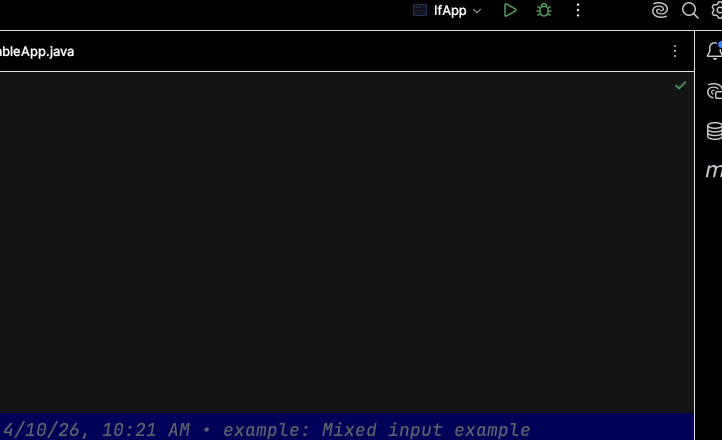

# Week 1

## Create a New Project

1. In the welcome window, choose "New Project" near the top
2. In the new project window, choose the following options:
   - Name: enter the name of your project
     > the name should be kebab-case (lowercase with dashes between words) Ex shopping-cart
   - Location: click the folder icon and navigate to your Pluralsight folder and choose it
   - Check the box: Create Git Repository (this will create a local git repository on your computer)
   - Build System: Maven
   - JDK: (first time) Click in the box to open the drop down > Choose Download JDK > Version 17 > Vendor Amazon Correto 17 the click Select
   - JDK: (every subsequent time) Choose Amazon Correto 17
   - Uncheck: Add sample code
   - Expand "Advanced Settings"
     - GroupId: com.pluralsight
3. Click the "Create" button
4. Got to the `\src\main\java` directory right-click and choose **Create Package**
5. Name the package `com.pluralsight`
6. Right-click on the package you just created and choose **New** > **Java class**
   - Be careful not to add the .java file extension, it will be added for you
7. This will be the class that starts your Java application. Common names for the class will be `App` or `Program`.
8. Add a `main` method to your class.
   > type `main` and choose the live code snippet and the method will be written for you

## Commit Your Code

1. Click the "-o-" (commit) icon in the left menu
2. Click the checkbox next to changes to choose all files
3. Click in the large textbox on the bottom left
4. Enter a commit message, for example "Initial commit"
   > Write messages as if you are giving the codebase an instruction
   > "If applied, this commit will..."
5. Click the "Commit" button if this is the first time your are committing for the project
6. Click the "Commit & Push" button if this is a subsequent commit (2nd time +)
   > Note that if you commit and then need to push you can go to the Git Menu and choose> Push

## Share on Github

1. In the file menu at the top, Choose Git > Github > Share project on Github
2. In the window, uncheck "private" (we want our repositories to be public)

## Naming Conventions

- project-name (shopping-app) lowercase with dashes between words (kebab-case)
- package.name (com.pluralsight) (reverse dns naming)
- ClassName (ShoppingList) PascalCasing
- commit message (initial commit) lowercase
- repository-name (shopping-app) lowercase with dashes between words (kebab-case)
- localVariable (item) camelCasing

## Variables

```java
//variable declaration
String favoriteColor;

//variable declaration and initialization
String favoriteColor = "yellow";

```

## Data Types

### Numbers

Do I need decimal places?

- Yes
  - float (smaller)
  - double (bigger) \*\*
- No
  - byte (smallest)
  - short (smaller)
  - int (small)
  - long (big)

### Text

Do I need store text?

- Yes
- Is it one character (often a letter)
  - Yes
    - char 'a'
  - No (multiple characters)
    - String "a dog"

### Boolean

true or false

## Reading Input

### Reading a String

```java
Scanner input = new Scanner(System.in);
System.out.print("Enter your name: ");

String name = input.nextLine();
System.out.println("Howdy " + name);
```

### Reading a Number

```java
Scanner input = new Scanner(System.in);
System.out.print("Enter your age: ");

int age = input.nextInt();
System.out.println("Your age is  " + age);
```

## Screenshot example



---

## Building Strings

### String Concatenation

```java
int id = 10135;
String name = "Brandon Plyers";

float pay = 5239.77f;

// String messageTemplate = "Brandon Plyers id:10135 $5239.77";
String messageUsingConcat =  name + " id:" + id + " $" + pay;

System.out.println(messageUsingConcat);

```

### String.format

```java
int id = 10135;
String name = "Brandon Plyers";

float pay = 5239.77f;

// String messageTemplate = "Brandon Plyers id:10135 $5239.77";
String messageUsingStringFormat = String.format("%s id:%d $%.2f", name, id, pay);

System.out.println(messageUsingStringFormat);

```

## If

```java
int magicNumber = 99;
boolean condition = magicNumber < 100 ;

if (condition) {
    System.out.println("condition is true");
    System.out.println("do something if it is true");
}

```

## Methods

### Big Picture

- Are verbs
- Are tasks being done on your behalf
  - sometimes it is easier to do things yourself
  - but, if you have to many things to do
    - it can be helpful to break the task down into smaller tasks
  - but, if you do the same things over and over again then delegating these tasks can be useful
  - methods are not only about potential reuse but they are about reducing complexity
- Can be used
  - inside the class where they are defined (private)
  - OR
  - outside the class where they are defined (public)
- Can
  - give you back something when completed (return) something
  - OR
  - can give you back nothing (void)
- Can require inputs to do the task (parameters)
- Can be organized together (in classes)
- Some tasks you can just use quickly (Class.doSomething) (static)
- Other tasks you need to do some setup before you can use them
  - Class object = new Class();
  - object.doSomething();
