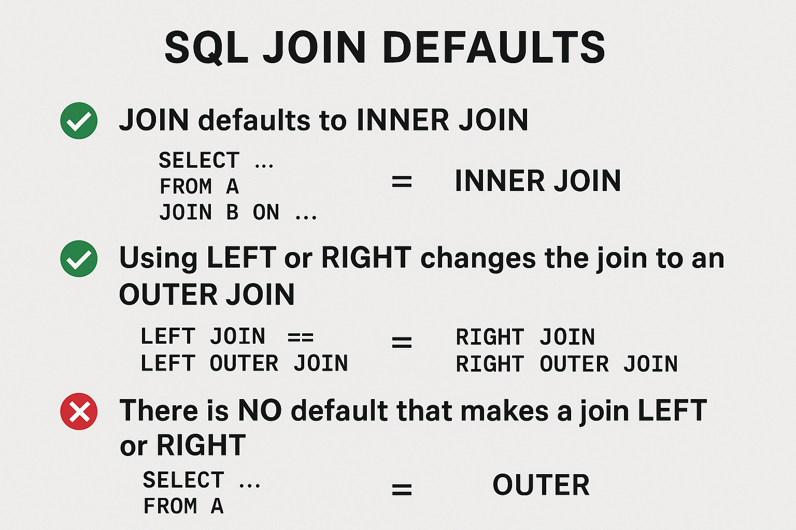

- [MySQL Compatibility](https://www.google.com/search?q=I+have+mysql+community+server+version+8.4.7+an+LTS+version%2C+what+version%28s%29+of+MySQL+Workbench+are+compatible%2Fsupported+with+that+server&sca_esv=4b1cc901675f4231&biw=1920&bih=992&sxsrf=ANbL-n6WKA_rCfOSnJX5yguyaH7ggJywqA%3A1779990426936&ei=mn8YaujvOOCw5NoPvLqn6A4&uact=5&sclient=gws-wiz-serp&fbs=ADc_l-aN0CWEZBOHjofHoaMMDiKpaEWjvZ2Py1XXV8d8KvlI3tR7kVu8a3MULVA9bsoO0mCCFiZoMv28ux3eOJ39Q_ixnRJO66C0xBAUoovRT1WiWc2wxNjs2dVEyHrCoGo856EpETgVR969UYyuERa8kxh5cbF1pplYbyQG2Wrvvm6Xcn4EUy6OtZW0DbuVqZV2omfZMmB8jz2e6x3wpB3R-ziGWrtgDg&aep=10&ntc=1&mstk=AUtExfBukJrNkG-AI5lHaj8m9wV2JbEFhJjjec2o6mM_sL4BinrOuCLSJAp2nhVAT-t-nU0HxyF2KfKU78gaqluS7WZ8m7s7FGt5gRsYH3lpMozafq2CyU_HefPvQiYspngjZ-Rby5hwQAhrL0Yq6z4Ef0xQHihfvItSkVH7oqfiCIrs9KifAv3aHAno1JLV-6jMQWkcq6Pto9znLYvJoT2MiQKfuPRD9djG27n1PpX9ZvlXt7mR-x0g1K_9yAWlt_R5ZZqQ2P85jt0F4g&aioh=3&csuir=1&cs=0&sourceid=chrome&ccb=1&hl=en-US&mtid=UIMYaq3WHJ7k5NoP-5rq6A8&udm=50)


## Terminology

C- CREATE
R- READ
U - UPDATE
D - DELETE

---
INSERT
SELECT
UPDATE
DELETE


<!-- ## Getting Started

1. Open MySQL Workbench
2. On the left panel choose the Schemas panel on the bottom
TODO: -->


- [Northwind SQL Join Scenarios Explained](https://gemini.google.com/app/283f3e5d4f097887)
- [FULL JOIN Data Reconciliation Use Case](https://gemini.google.com/app/5d818c9b44d9b7f3)
- [Note:Full Outer join not supported in MySQL](https://share.google/aimode/bP1XmG2HXny69ZGVU)


# **SQL Join Defaults**

### ✅ **1. `JOIN` defaults to `INNER JOIN`**

If you simply write:

```sql
SELECT …
FROM A
JOIN B ON …
```

…it **automatically means**:

```sql
INNER JOIN
```

You only get rows where the join condition matches in both tables.

---

### ✅ **2. Using `LEFT` or `RIGHT` _changes_ the join to an OUTER JOIN**

As soon as you use **LEFT** or **RIGHT**, SQL switches the join type:

- **LEFT JOIN** = **LEFT OUTER JOIN**
- **RIGHT JOIN** = **RIGHT OUTER JOIN**

These pairs are identical:

```sql
LEFT JOIN     == LEFT OUTER JOIN
RIGHT JOIN    == RIGHT OUTER JOIN
```

In other words:

> **LEFT or RIGHT automatically means OUTER.**
> You never need to write the word OUTER.

---

### 🔍 **3. There is NO default that makes a join LEFT or RIGHT**

You only get LEFT or RIGHT behavior if you explicitly include **LEFT** or **RIGHT**.
If you omit them, SQL always uses INNER.

---

### ❗ Quick Teaching Summary

- **JOIN = INNER JOIN** (default)
- **LEFT JOIN = LEFT OUTER JOIN**
- **RIGHT JOIN = RIGHT OUTER JOIN**
- **FULL OUTER JOIN** must be written explicitly (not supported in MySQL)

A great line to tell students:

> “SQL only assumes inner joins. But if you say LEFT or RIGHT, it automatically becomes an outer join.”

---




## JOIN References

- [Visual Explanation of SQL Joins](https://blog.codinghorror.com/a-visual-explanation-of-sql-joins/)
- [SQL Joins Explained in 5 minutes](https://www.acuitytraining.co.uk/news-tips/introduction-sql-joins/)